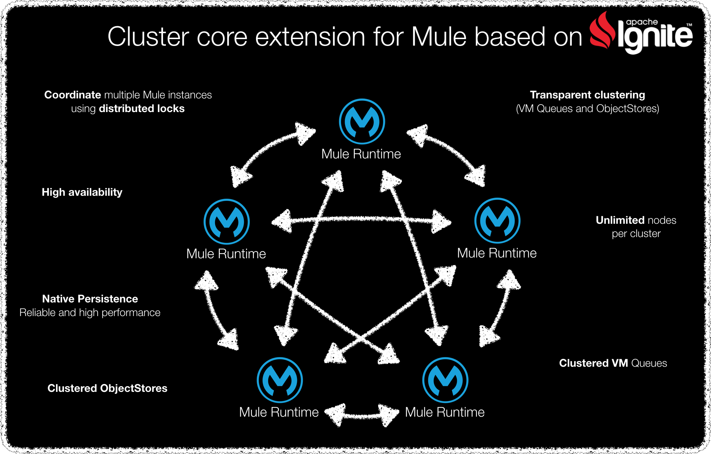

# Mule standalone v4.1.1 with Hawkore's cluster module



*All company names, logos, brand names and trademarks are property of their respective owners. All company, product and service names used in this website are for identification purposes only.*

## Requirements

	-  Java >= 1.8.0_151
	-  Maven >= 3.3.0
    -  Docker running on local machine

## Clone

	-  Clone this project: `git clone http://github.com/hawkore/assembly-mule4-distribution-hk.git`
	-  Change to directory: `cd assembly-mule4-distribution-hk`

## Versions so far

| image:version                                | Other tags | From                     |
| -------------------------------------------- | ---------- | ------------------------ |
| **docker.hawkore.com/hk/mule-hk:4.1.1**      |            | hawkore/openjdk:8u181 |
| **docker.hawkore.com/hk/mule-ee-hk:4.1.1**   |            | hawkore/openjdk:8u181 |


**Important:** Docker images are based on **hawkore/openjdk:8u181**. Please note that docker images are for testing purposes only. You should manage your own **java-8 base docker image**.

**Important**: Mule standalone version 4.1.1 zip file (community and/or enterprise) must be downloaded from Mulesoft and installed on your local maven repository. Please, preserve `groupId`, `artifactId`, `version` and `packaging` on below maven commands.

* Install Mule community stand-alone zip file on your local maven repository:

```sh
mvn install:install-file -Dfile=<path-to-mule-standalone-zip> -DgroupId=org.mule.distributions -DartifactId=mule-standalone -Dversion=4.1.1 -Dpackaging=zip
```

* Install Mule enterprise stand-alone zip file on your local maven repository:

```sh
mvn install:install-file -Dfile=<path-to-mule-standalone-zip> -DgroupId=com.mulesoft.muleesb.distributions -DartifactId=mule-ee-distribution-standalone -Dversion=4.1.1 -Dpackaging=zip
```

**Important**: Build is done through maven command. Use profile `assembly-community` for community edition and/or `assembly-ee` for enterprise edition.

``` sh
mvn clean install -Passembly-community,assembly-ee,generate-assembly,attach-assembly
```

Once assembly finishes you will get:

* Mule community edition + hk cluster module (`assembly-community`):
    * stand-alone assembly zip: **mule-community-hk/target/mule-standalone-hk-4.1.1.zip**
    * docker image: **docker.hawkore.com/hk/mule-hk:4.1.1**

* Mule enterprise edition + hk cluster module (`assembly-ee`):
    * stand-alone assembly zip: **mule-ee-hk/target/mule-ee-standalone-hk-4.1.1.zip**
    * docker image: **docker.hawkore.com/hk/mule-ee-hk:4.1.1**

## How to run a docker container

Replace `mule-hk` by `mule-ee-hk` on below commands to run enterprise edition
 
 - Manually

``` sh
$ docker run --name mule-hk --rm -t -i docker.hawkore.com/hk/mule-hk:4.1.1 /bin/bash
$ bin/mule
```

 - Backgroud

``` sh
docker run --name mule-hk --rm docker.hawkore.com/hk/mule-hk:4.1.1
```

## Overwrite default Mule container configuration:

HK Mule docker image has some mount points that you could mount on external volumes when create docker container, this easy change default configuration:

* `/opt/mule/logs`: mule log files.
* `/opt/mule/apps`: mule apps directory.
* `/opt/mule/domains`: mule domains directory.
* `/opt/mule/conf`: mule configuration files.
* `/opt/mule/work` : mule work directory (data storage).

# Other resources

Sign up at [www.hawkore.com](https://www.hawkore.com) to access full documentation.
